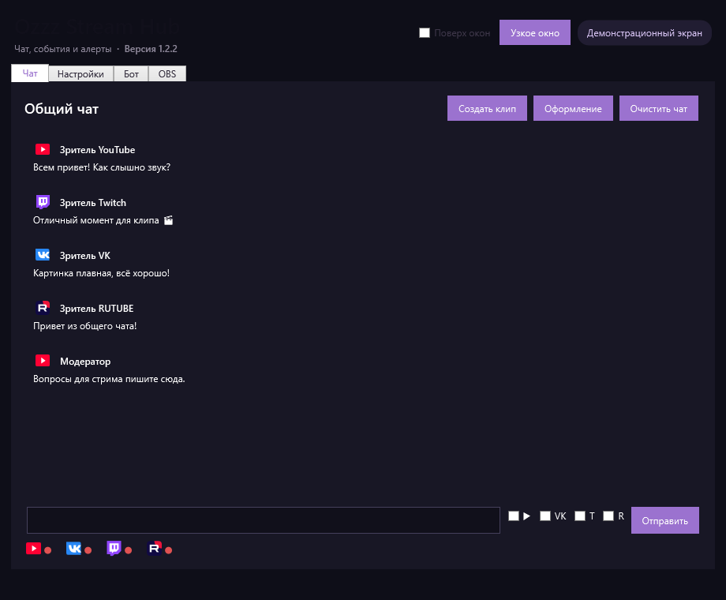
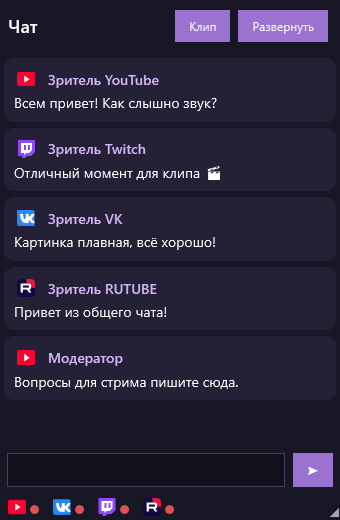
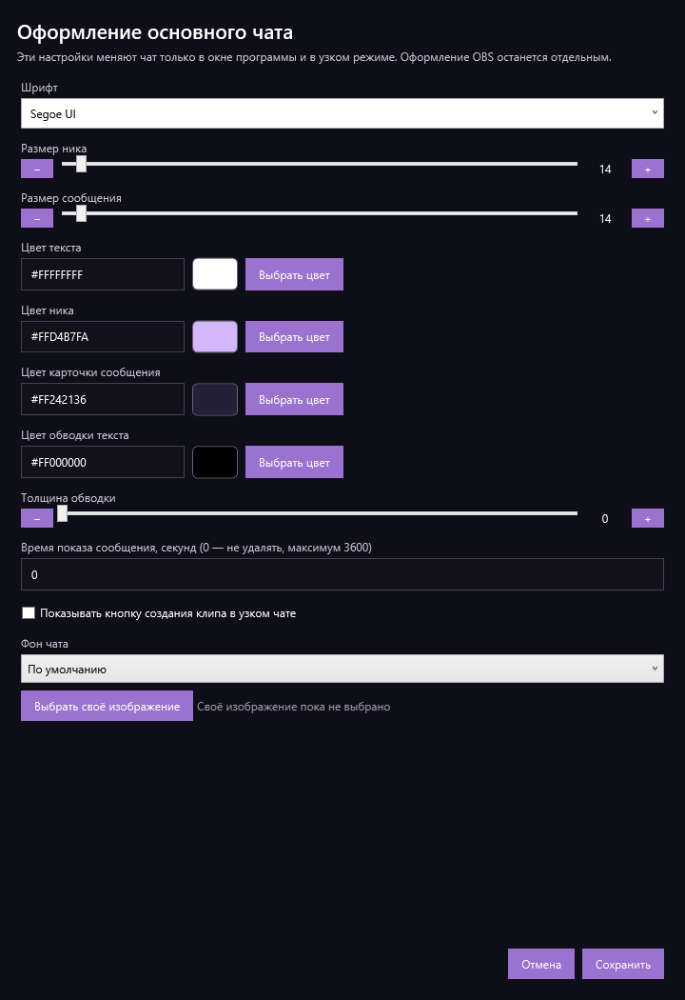
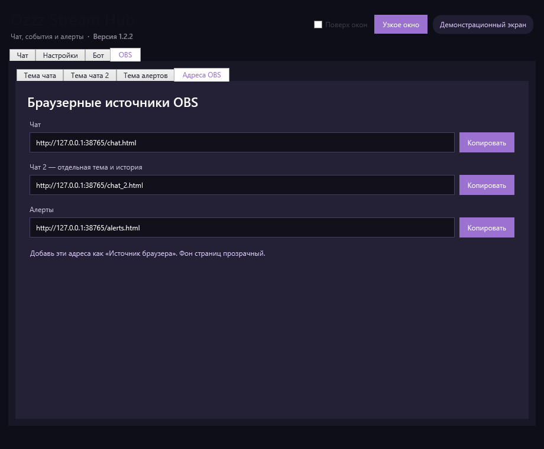

# Ozzz Stream Hub

**Чат, события и алерты для стрима в одном окне.** Ozzz Stream Hub собирает сообщения с YouTube, VK Видео Live, Twitch и RUTUBE, помогает следить за подключениями и выводит чат и алерты в OBS. Программа работает на Windows x64; интерфейс и настройки — на русском языке.

[**Скачать последнюю версию**](https://github.com/ozzz161/OzzzStreamHub/releases/latest) · [История релизов](https://github.com/ozzz161/OzzzStreamHub/releases)

## Возможности

| | |
| --- | --- |
| **Общий чат** | Сообщения YouTube, VK Видео Live, Twitch и RUTUBE в одном окне; обычный и узкий режимы, отдельные статусы площадок, оформление и выделение комментариев по словам или фразам. |
| **Подключение площадок** | Вход в YouTube, Twitch и RUTUBE из программы. Для VK Видео Live указывается ссылка на канал. YouTube может читать несколько одновременных эфиров одного канала. |
| **OBS** | Два браузерных источника чата с независимым оформлением и историей, отдельный источник алертов. Адреса копируются из программы. Есть готовые темы, шрифты, цвета, анимации, замена слов и скрытие ссылок. Для алертов выбираются GIF, звук и виды событий. |
| **События и бот** | События стрима и покупки за баллы, команды с задержкой между ответами, объявления по интервалу и активности чата. Для Twitch доступны команда и кнопка создания клипа. |
| **Устойчивость** | Защита от повторов сообщений и событий. При временном сбое YouTube-чата программа пытается восстановить подключение и при необходимости переключается на резервный способ чтения. |
| **Обновления** | Установленная версия проверяет новые релизы; перед установкой сверяются размер и SHA-256 скачанного файла. Настройки сохраняются локально. |

Набор доступных действий и событий зависит от площадки. Например, RUTUBE передаёт чат и донаты, но не предоставляет программе события подписок и рейдов.

## Интерфейс

Снимки сделаны с демонстрационными сообщениями без подключения к аккаунтам. Часть снимков показывает интерфейс предыдущей версии.

| Узкий чат | Настройка оформления |
| --- | --- |
|  |  |

**Источники для OBS:** в программе есть отдельная вкладка с адресами двух чатов и алертов. Фон браузерных источников прозрачный.

## Установка и первый запуск

1. Откройте [последний релиз](https://github.com/ozzz161/OzzzStreamHub/releases/latest) и скачайте файл `OzzzStreamHub-Setup-<версия>.exe`.
2. Запустите установщик на Windows x64 и откройте Ozzz Stream Hub.
3. Во вкладке **«Настройки»** подключите нужные площадки. Для VK Видео Live укажите ссылку на канал.
4. Если используете OBS, откройте **«OBS» → «Адреса OBS»**, скопируйте нужный адрес и добавьте его в OBS как **«Источник браузера»**.

При обновлении запускайте новый установщик поверх установленной версии или используйте встроенную проверку обновлений. `latest.json` в релизе нужен самой программе; скачивать его вручную не требуется.

## Версия 1.3.1

Исправлен индикатор VK Видео Live: если чат работает, но авторизация для показателей зрителей и лайков истекла, индикатор становится жёлтым и подсказывает повторно подключить площадку. После восстановления доступа счётчики и зелёный цвет возвращаются. Версия включает все возможности 1.3.0: выделение комментариев, правила текста для OBS, GIF и звук алертов и подробные статусы YouTube. Подробности и установщик — на [странице релиза v1.3.1](https://github.com/ozzz161/OzzzStreamHub/releases/tag/v1.3.1).
